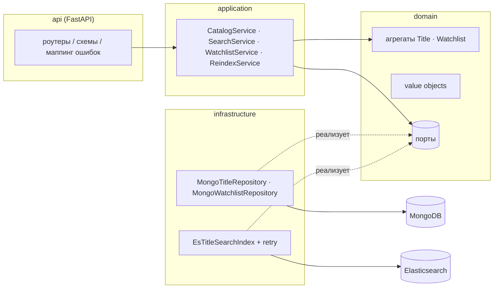

# Stream Catalog API

[](https://github.com/mxmaslin/elastic_mongo/actions/workflows/ci.yml)

[English version](README_EN.md)

## О проекте

Showcase **бэкенда каталога стримингового сервиса**: CRUD медиаконтента, полнотекстовый поиск, watchlist пользователя и безопасный reindex поискового индекса. Демонстрирует связку **MongoDB + Elasticsearch** в production-подобной архитектуре (DDD, ports/adapters, 95 тестов, CI).

## Какую задачу решает

Типичный каталог (Netflix-like) требует двух моделей данных:

- **документное хранилище** — вложенные сезоны/эпизоды, гибкая схема, optimistic concurrency;
- **поисковый движок** — full-text, fuzziness, фильтры, релевантность, highlight.

Сервис показывает, как держать **MongoDB источником истины**, а ES — **read-проекцией** с graceful degradation (CRUD работает, если ES лежит; reindex сходимость) и alias-swap reindex без даунтайма.

## Как устроено

Слои **api → application → domain → infrastructure**: HTTP переводится в команды сервисов (`CatalogService`, `SearchService`, `WatchlistService`, `ReindexService`); domain-агрегаты работают через порты; MongoDB и Elasticsearch — адаптеры. Схема потоков данных:

## Архитектура



Правила слоёв: **domain** — чистый Python (никаких импортов фреймворков
и драйверов), **application** оркестрирует агрегаты через порты,
**infrastructure** реализует порты, **api** переводит HTTP в команды,
а доменные ошибки — в статус-коды (404 / 409 / 422 / 503).

### Консистентность и отказоустойчивость

MongoDB — источник истины; Elasticsearch — проекция.

- Запись сначала идёт в MongoDB, затем документ индексируется
  **best-effort** (retry с экспоненциальным backoff внутри адаптера).
  Если поисковый бэкенд лежит, запись всё равно проходит и API остаётся
  доступным — поиск сходится к истине после `POST /v1/admin/reindex`.
- Поиску бэкенд необходим, поэтому его недоступность отображается
  в **503** с внятным телом ответа, а CRUD каталога продолжает работать
  (graceful degradation, проверено тестами).
- Оба агрегата используют **optimistic concurrency** (поле `version`
  проверяется на уровне репозитория); use case watchlist'а повторяет
  конфликтующие операции ограниченное число раз.
- Публичное имя индекса — **alias**: reindex наполняет свежий физический
  индекс и атомарно переключает alias, так что поиск никогда не видит
  полусобранный индекс, а перестройка проходит без простоя.

**Осознанный trade-off:** dual-write (сначала Mongo, потом ES) может
потерять обновление индекса при падении между двумя записями.
Производственное решение — транзакционный outbox с асинхронным
проектором (или CDC через change streams); здесь механизмом сходимости
служит эндпоинт reindex — демо остаётся честным и не делает вид, что
проблемы не существует.

### Ключевые решения и почему

- **DDD-слои и ports/adapters.** Domain и application не знают о Mongo
  и ES — они работают с портами (протоколами). Это даёт быстрые
  unit-тесты бизнес-логики без I/O и возможность заменить адаптер
  (например, ES на OpenSearch), не трогая use case'ы.
- **Optimistic concurrency через поле `version`** вместо транзакций
  и локов. Конфликты записи здесь редки, поэтому проверка `version`
  в условии update дешевле пессимистичных блокировок и не требует
  replica set ради многодокументных транзакций. Проигравший получает
  409; use case watchlist'а сам повторяет конфликтующую операцию
  ограниченное число раз.
- **Best-effort индексация с retry и экспоненциальным backoff** вместо
  outbox/CDC — осознанный trade-off (см. выше): доступность записи
  важнее мгновенной консистентности поиска, а reindex гарантирует
  сходимость.
- **Reindex без даунтайма через alias swap.** Публичное имя индекса —
  alias. Reindex наполняет новый физический индекс и одним атомарным
  `update_aliases` переключает alias со сносом старого индекса
  (`remove_index`) — поиск ни на секунду не видит пустой или
  полусобранный индекс.
- **Batch-резолв watchlist'а.** Тайтлы из списка читаются одним
  `get_many` (`$in`-запрос) вместо N+1 обращений к базе; ссылки на
  удалённые тайтлы просто пропускаются.
- **Идемпотентные PUT/DELETE у watchlist'а.** Повтор запроса безопасен
  (сетевые ретраи клиента ничего не ломают), ответ `{"changed": bool}`
  сообщает, изменилось ли состояние.
- **Value objects с самовалидацией.** `TitleId`, `Genre`, `ReleaseYear`,
  `Rating` проверяют себя в конструкторе — невалидное значение просто
  невозможно пронести вглубь системы.
- **Маппинг доменных ошибок на HTTP** в одном месте: `TitleNotFound` →
  404, конфликты и лимит watchlist'а → 409, доменная валидация → 422,
  недоступный поиск → 503. Роутеры не знают о статус-кодах, домен —
  о HTTP.

## Стек и почему

| Технология | Зачем |
|------------|-------|
| **FastAPI** | Тонкий HTTP-слой; OpenAPI; маппинг доменных ошибок в status codes |
| **MongoDB** | Документная модель для Title (фильмы/сериалы с сезонами); источник истины; optimistic `version` |
| **Elasticsearch** | `multi_match`, fuzziness, фильтры, сортировка, highlight — то, что реляционка/ Mongo query language тянет хуже |
| **DDD (domain / application / infrastructure / api)** | Бизнес-правила и use case'ы без импортов драйверов; in-memory fakes для unit-тестов |
| **Alias-swap reindex** | Перестройка индекса без простоя поиска — атомарное переключение alias |
| **pytest + ruff + mypy + CI** | Пирамида тестов (unit без I/O → integration на реальных Mongo/ES) |

## Что умеет

- **CRUD каталога** — фильмы и сериалы со вложенными сезонами и эпизодами;
  хранятся в MongoDB (источник истины).
- **Полнотекстовый поиск** — `multi_match` по названию, актёрам и описанию
  с fuzziness, фильтры по жанру/типу/годам, сортировка (релевантность,
  рейтинг, год), подсветка совпадений и пагинация — на Elasticsearch.
- **Watchlist** — список «посмотреть позже» для каждого пользователя
  с идемпотентными PUT/DELETE; инварианты (без дублей, ограничение размера)
  контролирует агрегат.
- **Reindex** — один вызов перестраивает поисковый индекс из MongoDB без
  простоя поиска (новый физический индекс + атомарное переключение alias).
- **Health-пробы** — liveness и readiness (проверяет оба бэкенда).

## API вкратце

| Метод | Путь | Назначение |
|-------|------|------------|
| POST | `/v1/titles` | Создать фильм/сериал |
| GET | `/v1/titles` | Список (постранично, новые первыми) |
| GET / PUT / DELETE | `/v1/titles/{id}` | Чтение / обновление / удаление |
| GET | `/v1/search/titles` | Полнотекстовый поиск + фильтры |
| PUT / DELETE | `/v1/users/{uid}/watchlist/{title_id}` | Идемпотентное добавление/удаление |
| GET | `/v1/users/{uid}/watchlist` | Watchlist с резолвом тайтлов |
| POST | `/v1/admin/reindex` | Перестроить поисковый индекс |
| GET | `/health/live`, `/health/ready` | Пробы |

```bash
curl -s -X POST localhost:8000/v1/titles -H 'content-type: application/json' -d '{
  "name": "Inception", "type": "movie",
  "description": "A thief steals corporate secrets through dream-sharing.",
  "genres": ["Sci-Fi", "thriller"], "release_year": 2010,
  "cast": ["Leonardo DiCaprio"], "rating": 8.8
}'

curl -s 'localhost:8000/v1/search/titles?q=dream+thief&genre=sci-fi&year_from=2005&sort=relevance'
```

Интерактивная документация: `http://localhost:8000/docs`.

## Запуск

```bash
docker compose up --build          # API на :8000, MongoDB на :27017, ES на :9200
```

Локальная разработка:

```bash
python3 -m venv .venv && . .venv/bin/activate
pip install -e ".[dev]"
docker compose up -d mongo elasticsearch
uvicorn stream_catalog.api.app:app --reload
```

## Тестирование

Классическая пирамида: unit → integration → e2e API.

- **59 unit-тестов без I/O.** Сервисы и агрегаты тестируются на
  **in-memory фейках** портов — не на моках: фейки реализуют контракт
  порта целиком (включая проверку `version` и конфликты), поэтому тесты
  проверяют поведение, а не последовательность вызовов. Покрыты
  конфликтные ретраи watchlist'а, идемпотентность, валидация value
  objects и graceful degradation (создание/обновление проходит, когда
  поисковый индекс кидает `SearchUnavailableError`).
- **36 интеграционных и e2e тестов** против **реальных** MongoDB
  и Elasticsearch из docker compose: репозитории (stale save → 409),
  поисковый индекс (релевантность, фильтры, alias-swap reindex)
  и полные HTTP-сценарии через приложение. Недоступность ES проверяется
  честно — клиентом на мёртвый порт, а не моком.
- **Изоляция прогонов:** каждая тест-сессия работает в базе и индексе
  с uuid-суффиксом, поэтому параллельные прогоны и остатки прошлых
  не мешают друг другу.

```bash
ruff check . && ruff format --check .   # линтер + форматирование
mypy                                     # строгая проверка типов
pytest tests/unit -q                     # чистые unit-тесты, без I/O
docker compose up -d mongo elasticsearch
pytest tests/integration -q              # реальные Mongo + ES + e2e API
```

Те же гейты выполняются в CI (GitHub Actions): lint → unit → integration
(с сервис-контейнерами MongoDB и Elasticsearch) → docker build.

## Наблюдаемость

Что есть в проекте (и только это — без приписок):

- **Логи деградации.** Адаптеры и сервисы пишут структурные записи
  о нештатных ситуациях: `warning`, когда ES недоступен и документ
  сохранён, но не проиндексирован (с подсказкой запустить reindex),
  и `info` при повторе конфликтующей операции watchlist'а.
- **Health-пробы.** `/health/live` — liveness; `/health/ready`
  опрашивает оба бэкенда и при деградации отвечает **503** с телом,
  где видно состояние каждого (`mongodb` / `elasticsearch`).
- **HEALTHCHECK** объявлен и в Dockerfile, и в docker-compose —
  оркестратор видит состояние контейнеров без внешней настройки.
- **Retry с экспоненциальным backoff** в ES-адаптере; число попыток
  и базовая задержка конфигурируемы.

Метрик и трейсинга (Prometheus, OpenTelemetry) в проекте **нет** —
это честно вынесено в production-заметки ниже как следующий шаг,
а не выдано за существующее.

## Production-заметки (сознательно за рамками проекта)

- Outbox/CDC вместо best-effort dual-write (см. trade-off выше).
- AuthN/AuthZ (админский эндпоинт reindex должен стоять за RBAC).
- Реплики Elasticsearch, ILM, снапшоты; replica set MongoDB.
- Метрики и трейсинг (Prometheus + OpenTelemetry) поверх структурных логов.
