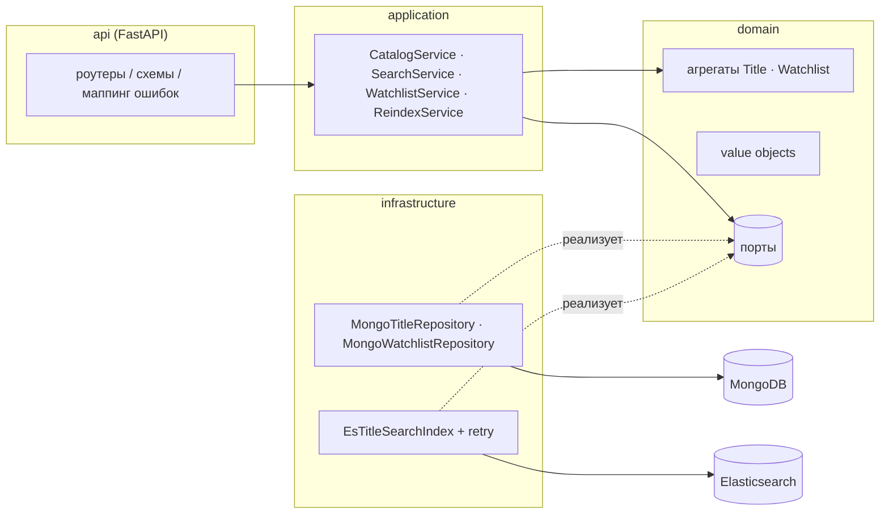

# Stream Catalog API

[](https://github.com/mxmaslin/elastic_mongo/actions/workflows/ci.yml)

Сервис каталога и поиска медиаконтента — бэкенд того типа, что стоит за
экраном каталога стримингового приложения. Компактный, но устроенный
по-производственному showcase **MongoDB** (документная модель, optimistic
concurrency, атомарные upsert'ы) и **Elasticsearch** (полнотекстовый поиск,
фильтры, настройка релевантности) с **DDD-слоями** и полным покрытием
unit-, интеграционными и end-to-end тестами.

## Что умеет

- **CRUD каталога** — фильмы и сериалы со вложенными сезонами и эпизодами;
  хранятся в MongoDB (источник истины).
- **Полнотекстовый поиск** — `multi_match` по названию, актёрам и описанию
  с fuzziness, фильтры по жанру/типу/годам, сортировка (релевантность,
  рейтинг, год), подсветка совпадений и пагинация — на Elasticsearch.
- **Watchlist** — список «посмотреть позже» для каждого пользователя
  с идемпотентными PUT/DELETE; инварианты (без дублей, ограничение размера)
  контролирует агрегат.
- **Reindex** — один вызов перестраивает поисковый индекс из MongoDB без
  простоя поиска (новый физический индекс + атомарное переключение alias).
- **Health-пробы** — liveness и readiness (проверяет оба бэкенда).

## Архитектура



Правила слоёв: **domain** — чистый Python (никаких импортов фреймворков
и драйверов), **application** оркестрирует агрегаты через порты,
**infrastructure** реализует порты, **api** переводит HTTP в команды,
а доменные ошибки — в статус-коды (404 / 409 / 422 / 503).

### Консистентность и отказоустойчивость

MongoDB — источник истины; Elasticsearch — проекция.

- Запись сначала идёт в MongoDB, затем документ индексируется
  **best-effort** (retry с экспоненциальным backoff внутри адаптера).
  Если поисковый бэкенд лежит, запись всё равно проходит и API остаётся
  доступным — поиск сходится к истине после `POST /v1/admin/reindex`.
- Поиску бэкенд необходим, поэтому его недоступность отображается
  в **503** с внятным телом ответа, а CRUD каталога продолжает работать
  (graceful degradation, проверено тестами).
- Оба агрегата используют **optimistic concurrency** (поле `version`
  проверяется на уровне репозитория); use case watchlist'а повторяет
  конфликтующие операции ограниченное число раз.
- Публичное имя индекса — **alias**: reindex наполняет свежий физический
  индекс и атомарно переключает alias, так что поиск никогда не видит
  полусобранный индекс, а перестройка проходит без простоя.

**Осознанный trade-off:** dual-write (сначала Mongo, потом ES) может
потерять обновление индекса при падении между двумя записями.
Производственное решение — транзакционный outbox с асинхронным
проектором (или CDC через change streams); здесь механизмом сходимости
служит эндпоинт reindex — демо остаётся честным и не делает вид, что
проблемы не существует.

## API вкратце

| Метод | Путь | Назначение |
|-------|------|------------|
| POST | `/v1/titles` | Создать фильм/сериал |
| GET | `/v1/titles` | Список (постранично, новые первыми) |
| GET / PUT / DELETE | `/v1/titles/{id}` | Чтение / обновление / удаление |
| GET | `/v1/search/titles` | Полнотекстовый поиск + фильтры |
| PUT / DELETE | `/v1/users/{uid}/watchlist/{title_id}` | Идемпотентное добавление/удаление |
| GET | `/v1/users/{uid}/watchlist` | Watchlist с резолвом тайтлов |
| POST | `/v1/admin/reindex` | Перестроить поисковый индекс |
| GET | `/health/live`, `/health/ready` | Пробы |

```bash
curl -s -X POST localhost:8000/v1/titles -H 'content-type: application/json' -d '{
  "name": "Inception", "type": "movie",
  "description": "A thief steals corporate secrets through dream-sharing.",
  "genres": ["Sci-Fi", "thriller"], "release_year": 2010,
  "cast": ["Leonardo DiCaprio"], "rating": 8.8
}'

curl -s 'localhost:8000/v1/search/titles?q=dream+thief&genre=sci-fi&year_from=2005&sort=relevance'
```

Интерактивная документация: `http://localhost:8000/docs`.

## Запуск

```bash
docker compose up --build          # API на :8000, MongoDB на :27017, ES на :9200
```

Локальная разработка:

```bash
python3 -m venv .venv && . .venv/bin/activate
pip install -e ".[dev]"
docker compose up -d mongo elasticsearch
uvicorn stream_catalog.api.app:app --reload
```

## Тесты и quality gates

```bash
ruff check . && ruff format --check .   # линтер + форматирование
mypy                                     # строгая проверка типов
pytest tests/unit -q                     # чистые unit-тесты, без I/O
docker compose up -d mongo elasticsearch
pytest tests/integration -q              # реальные Mongo + ES + e2e API
```

Те же гейты выполняются в CI (GitHub Actions): lint → unit → integration
(с сервис-контейнерами MongoDB и Elasticsearch) → docker build.
Интеграционные тесты используют базу и индекс с uuid-суффиксом на сессию,
поэтому прогоны не мешают друг другу.

## Production-заметки (сознательно за рамками проекта)

- Outbox/CDC вместо best-effort dual-write (см. trade-off выше).
- AuthN/AuthZ (админский эндпоинт reindex должен стоять за RBAC).
- Реплики Elasticsearch, ILM, снапшоты; replica set MongoDB.
- Метрики и трейсинг (Prometheus + OpenTelemetry) поверх структурных логов.
