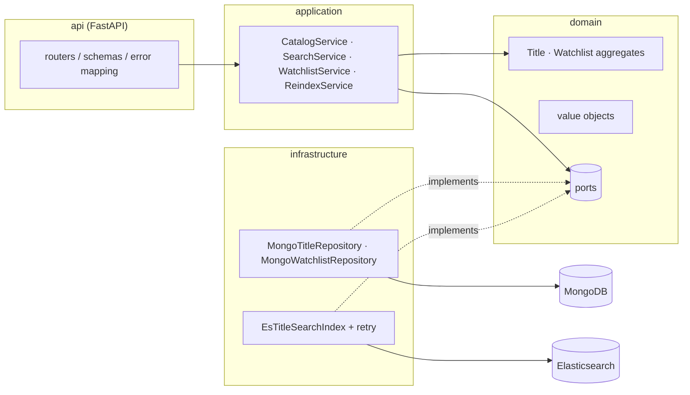

# Stream Catalog API

[](https://github.com/mxmaslin/elastic_mongo/actions/workflows/ci.yml)

A media catalog & search service — the kind of backend that powers the catalog
screen of a streaming app. Built as a compact but production-shaped showcase of
**MongoDB** (document modeling, optimistic concurrency, atomic upserts) and
**Elasticsearch** (full-text search, filters, relevance tuning), organized with
**DDD layering** and fully covered by unit, integration and end-to-end tests.

## What it does

- **Catalog CRUD** — movies and series with embedded seasons/episodes,
  stored in MongoDB (the source of truth).
- **Full-text search** — `multi_match` over name/cast/description with fuzziness,
  genre/type/year filters, sorting (relevance, rating, year), highlighting and
  pagination, backed by Elasticsearch.
- **Watchlists** — a per-user list with idempotent PUT/DELETE semantics,
  duplicate/size invariants enforced by the aggregate.
- **Reindex** — one call rebuilds the search index from MongoDB.
- **Health probes** — liveness and readiness (checks both backends).

## Architecture



Layering rules: **domain** is pure Python (no framework or driver imports),
**application** orchestrates aggregates through ports, **infrastructure**
implements the ports, **api** maps HTTP onto commands and domain errors onto
status codes (404 / 409 / 422 / 503).

### Consistency & fault tolerance

MongoDB is the source of truth; Elasticsearch is a projection.

- Writes go to MongoDB first, then the document is indexed **best-effort**
  (retries with exponential backoff inside the adapter). If the search backend
  is down, the write still succeeds and the API stays available — search
  results converge after `POST /v1/admin/reindex`.
- Search requires the backend, so an outage maps to **503** with a clear body,
  while catalog CRUD keeps working (graceful degradation, verified by tests).
- Both aggregates use **optimistic concurrency** (a `version` field guarded at
  the repository level); the watchlist use case retries conflicts a bounded
  number of times.

**Trade-off, documented on purpose:** dual-write (Mongo, then ES) can lose an
index update on a crash between the two writes. The production-grade fix is a
transactional outbox + async projector (or CDC via change streams); for this
service the reindex endpoint is the convergence mechanism, keeping the demo
honest without pretending the problem doesn't exist.

## API at a glance

| Method | Path | Purpose |
|--------|------|---------|
| POST | `/v1/titles` | Create a movie/series |
| GET | `/v1/titles` | List (paged, newest first) |
| GET / PUT / DELETE | `/v1/titles/{id}` | Read / update / delete |
| GET | `/v1/search/titles` | Full-text search + filters |
| PUT / DELETE | `/v1/users/{uid}/watchlist/{title_id}` | Idempotent add/remove |
| GET | `/v1/users/{uid}/watchlist` | Watchlist with resolved titles |
| POST | `/v1/admin/reindex` | Rebuild the search index |
| GET | `/health/live`, `/health/ready` | Probes |

```bash
curl -s -X POST localhost:8000/v1/titles -H 'content-type: application/json' -d '{
  "name": "Inception", "type": "movie",
  "description": "A thief steals corporate secrets through dream-sharing.",
  "genres": ["Sci-Fi", "thriller"], "release_year": 2010,
  "cast": ["Leonardo DiCaprio"], "rating": 8.8
}'

curl -s 'localhost:8000/v1/search/titles?q=dream+thief&genre=sci-fi&year_from=2005&sort=relevance'
```

Interactive docs: `http://localhost:8000/docs`.

## Running

```bash
docker compose up --build          # API on :8000, MongoDB on :27017, ES on :9200
```

Local development:

```bash
python3 -m venv .venv && . .venv/bin/activate
pip install -e ".[dev]"
docker compose up -d mongo elasticsearch
uvicorn stream_catalog.api.app:app --reload
```

## Tests & quality gates

```bash
ruff check . && ruff format --check .   # lint + formatting
mypy                                     # strict type checking
pytest tests/unit -q                     # pure unit tests, no I/O
docker compose up -d mongo elasticsearch
pytest tests/integration -q              # real Mongo + ES + e2e API
```

The same gates run in CI (GitHub Actions): lint → unit → integration
(with MongoDB and Elasticsearch service containers) → docker build.
Integration tests use a uuid-suffixed database and index per session, so
runs never interfere.

## Production notes (out of scope here, by design)

- Outbox/CDC instead of best-effort dual-write (see trade-off above).
- AuthN/AuthZ (the admin reindex endpoint must sit behind RBAC).
- Elasticsearch replicas, ILM, snapshots; MongoDB replica set.
- Metrics/tracing (Prometheus + OpenTelemetry) on top of the structured logs.
