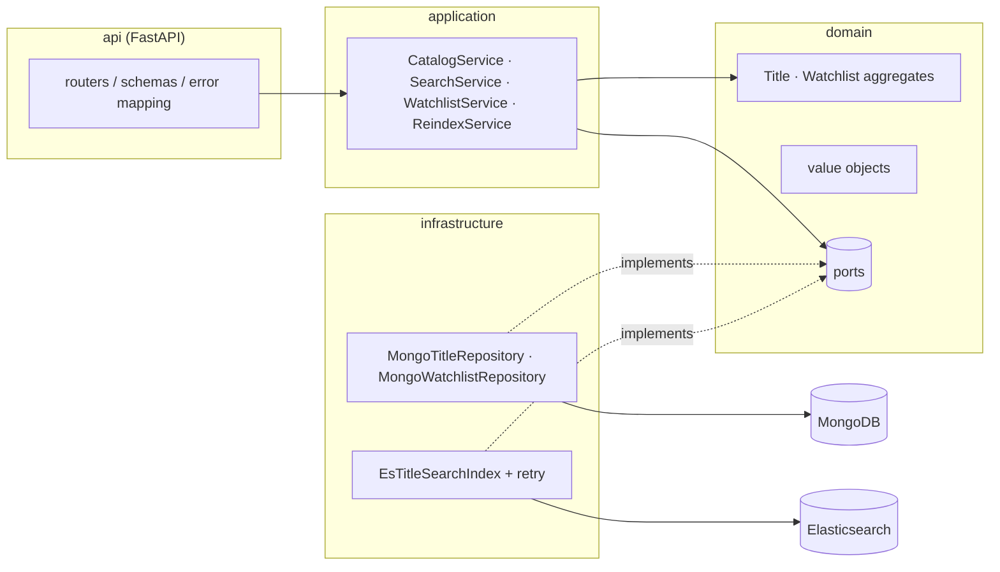

# Stream Catalog API

[](https://github.com/mxmaslin/elastic_mongo/actions/workflows/ci.yml)

[Русская версия](README.md)

A media catalog & search service — the kind of backend that powers the catalog
screen of a streaming app. Built as a compact but production-shaped showcase of
**MongoDB** (document modeling, optimistic concurrency, atomic upserts) and
**Elasticsearch** (full-text search, filters, relevance tuning), organized with
**DDD layering** and fully covered by unit, integration and end-to-end tests.

## What it does

- **Catalog CRUD** — movies and series with embedded seasons/episodes,
  stored in MongoDB (the source of truth).
- **Full-text search** — `multi_match` over name/cast/description with fuzziness,
  genre/type/year filters, sorting (relevance, rating, year), highlighting and
  pagination, backed by Elasticsearch.
- **Watchlists** — a per-user list with idempotent PUT/DELETE semantics,
  duplicate/size invariants enforced by the aggregate.
- **Reindex** — one call rebuilds the search index from MongoDB with zero
  search downtime (a fresh physical index + an atomic alias swap).
- **Health probes** — liveness and readiness (checks both backends).

## Architecture



Layering rules: **domain** is pure Python (no framework or driver imports),
**application** orchestrates aggregates through ports, **infrastructure**
implements the ports, **api** maps HTTP onto commands and domain errors onto
status codes (404 / 409 / 422 / 503).

### Consistency & fault tolerance

MongoDB is the source of truth; Elasticsearch is a projection.

- Writes go to MongoDB first, then the document is indexed **best-effort**
  (retries with exponential backoff inside the adapter). If the search backend
  is down, the write still succeeds and the API stays available — search
  results converge after `POST /v1/admin/reindex`.
- Search requires the backend, so an outage maps to **503** with a clear body,
  while catalog CRUD keeps working (graceful degradation, verified by tests).
- Both aggregates use **optimistic concurrency** (a `version` field guarded at
  the repository level); the watchlist use case retries conflicts a bounded
  number of times.
- The public index name is an **alias**: reindex populates a fresh physical
  index and switches the alias atomically, so search never sees a half-built
  index and the rebuild causes no downtime.

**Trade-off, documented on purpose:** dual-write (Mongo, then ES) can lose an
index update on a crash between the two writes. The production-grade fix is a
transactional outbox + async projector (or CDC via change streams); for this
service the reindex endpoint is the convergence mechanism, keeping the demo
honest without pretending the problem doesn't exist.

### Key design decisions and why

- **DDD layering and ports/adapters.** Domain and application know nothing
  about Mongo or ES — they work with ports (protocols). This buys fast
  unit tests of the business logic with no I/O, and lets an adapter be
  swapped out (say, ES for OpenSearch) without touching the use cases.
- **Optimistic concurrency via a `version` field** instead of transactions
  and locks. Write conflicts are rare here, so a `version` check in the
  update condition is cheaper than pessimistic locking and doesn't require
  a replica set just for multi-document transactions. The loser gets a 409;
  the watchlist use case retries the conflicting operation itself, a
  bounded number of times.
- **Best-effort indexing with retries and exponential backoff** instead of
  outbox/CDC — a deliberate trade-off (see above): write availability
  matters more than instantly consistent search, and reindex guarantees
  convergence.
- **Zero-downtime reindex via alias swap.** The public index name is an
  alias. Reindex populates a new physical index and, in a single atomic
  `update_aliases` call, switches the alias while dropping the old index
  (`remove_index`) — search never sees an empty or half-built index, not
  even for a second.
- **Batch resolution of the watchlist.** Listed titles are fetched with a
  single `get_many` (an `$in` query) instead of N+1 round trips to the
  database; references to deleted titles are simply skipped.
- **Idempotent PUT/DELETE on the watchlist.** Retrying a request is safe
  (client-side network retries break nothing), and the `{"changed": bool}`
  response tells whether the state actually changed.
- **Self-validating value objects.** `TitleId`, `Genre`, `ReleaseYear`,
  `Rating` validate themselves in the constructor — an invalid value simply
  cannot be smuggled deep into the system.
- **Domain-error-to-HTTP mapping** in one place: `TitleNotFound` → 404,
  conflicts and the watchlist size limit → 409, domain validation → 422,
  search unavailable → 503. Routers know nothing about status codes, and
  the domain knows nothing about HTTP.

## API at a glance

| Method | Path | Purpose |
|--------|------|---------|
| POST | `/v1/titles` | Create a movie/series |
| GET | `/v1/titles` | List (paged, newest first) |
| GET / PUT / DELETE | `/v1/titles/{id}` | Read / update / delete |
| GET | `/v1/search/titles` | Full-text search + filters |
| PUT / DELETE | `/v1/users/{uid}/watchlist/{title_id}` | Idempotent add/remove |
| GET | `/v1/users/{uid}/watchlist` | Watchlist with resolved titles |
| POST | `/v1/admin/reindex` | Rebuild the search index |
| GET | `/health/live`, `/health/ready` | Probes |

```bash
curl -s -X POST localhost:8000/v1/titles -H 'content-type: application/json' -d '{
  "name": "Inception", "type": "movie",
  "description": "A thief steals corporate secrets through dream-sharing.",
  "genres": ["Sci-Fi", "thriller"], "release_year": 2010,
  "cast": ["Leonardo DiCaprio"], "rating": 8.8
}'

curl -s 'localhost:8000/v1/search/titles?q=dream+thief&genre=sci-fi&year_from=2005&sort=relevance'
```

Interactive docs: `http://localhost:8000/docs`.

## Running

```bash
docker compose up --build          # API on :8000, MongoDB on :27017, ES on :9200
```

Local development:

```bash
python3 -m venv .venv && . .venv/bin/activate
pip install -e ".[dev]"
docker compose up -d mongo elasticsearch
uvicorn stream_catalog.api.app:app --reload
```

## Testing

A classic pyramid: unit → integration → e2e API.

- **59 unit tests with no I/O.** Services and aggregates are tested against
  **in-memory fakes** of the ports — not mocks: the fakes implement the full
  port contract (including the `version` check and conflicts), so the tests
  verify behavior rather than call sequences. Covered: watchlist conflict
  retries, idempotency, value object validation, and graceful degradation
  (create/update succeeds while the search index raises
  `SearchUnavailableError`).
- **36 integration and e2e tests** against **real** MongoDB and
  Elasticsearch from docker compose: repositories (stale save → 409), the
  search index (relevance, filters, alias-swap reindex) and full HTTP
  scenarios through the app. ES unavailability is tested honestly — with a
  client pointed at a dead port, not a mock.
- **Run isolation:** each test session works in a database and index with a
  uuid suffix, so parallel runs and leftovers from previous ones never
  interfere.

```bash
ruff check . && ruff format --check .   # lint + formatting
mypy                                     # strict type checking
pytest tests/unit -q                     # pure unit tests, no I/O
docker compose up -d mongo elasticsearch
pytest tests/integration -q              # real Mongo + ES + e2e API
```

The same gates run in CI (GitHub Actions): lint → unit → integration
(with MongoDB and Elasticsearch service containers) → docker build.

## Observability

What the project actually has (and nothing more — no embellishment):

- **Degradation logs.** Adapters and services emit structured records for
  abnormal situations: a `warning` when ES is unavailable and a document
  was saved but not indexed (with a hint to run reindex), and an `info`
  when a conflicting watchlist operation is retried.
- **Health probes.** `/health/live` is liveness; `/health/ready` polls both
  backends and, when degraded, answers **503** with a body showing the
  state of each (`mongodb` / `elasticsearch`).
- **HEALTHCHECK** is declared in both the Dockerfile and docker-compose —
  the orchestrator sees container health with no extra setup.
- **Retries with exponential backoff** in the ES adapter; the attempt count
  and base delay are configurable.

There are **no** metrics or tracing (Prometheus, OpenTelemetry) in the
project — that is honestly listed in the production notes below as a next
step, not passed off as existing.

## Production notes (out of scope here, by design)

- Outbox/CDC instead of best-effort dual-write (see trade-off above).
- AuthN/AuthZ (the admin reindex endpoint must sit behind RBAC).
- Elasticsearch replicas, ILM, snapshots; MongoDB replica set.
- Metrics/tracing (Prometheus + OpenTelemetry) on top of the structured logs.
